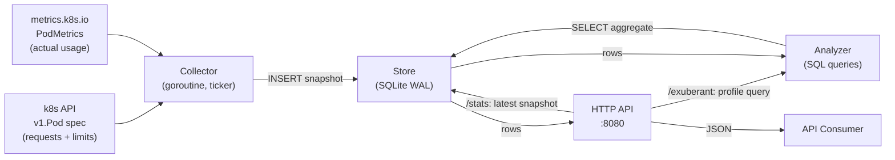

# Winston Architecture

Winston is a single-binary Go application that observes pod resource usage across an entire k3s cluster, stores time-series snapshots in an embedded SQLite database, and exposes analysis results over a simple HTTP API.

---

## 1. Project Layout

```
winston/
├── cmd/
│   └── winston/
│       └── main.go           # Binary entrypoint: wires components, starts goroutines
├── internal/
│   ├── collector/
│   │   └── collector.go      # Kubernetes client, polling loop, snapshot writes
│   ├── store/
│   │   ├── store.go          # SQLite open/migrate, WAL pragma, prepared statements
│   │   └── schema.sql        # Embedded schema (go:embed)
│   ├── analyzer/
│   │   └── analyzer.go       # Exuberance profile queries, result structs
│   ├── report/
│   │   └── report.go         # Renders analysis as JSON or Markdown; shared by API and CLI
│   └── api/
│       └── server.go         # net/http handlers: /stats, /exuberant, / (static UI)
│       └── static/
│           └── index.html    # Embedded UI (go:embed); fetches JSON API, renders client-side
├── helm/
│   └── winston/
│       ├── Chart.yaml
│       ├── values.yaml
│       └── templates/
│           ├── serviceaccount.yaml
│           ├── clusterrole.yaml
│           ├── clusterrolebinding.yaml
│           ├── deployment.yaml
│           ├── pvc.yaml
│           └── service.yaml
├── Dockerfile
├── .gitignore
└── docs/
    └── architecture.md       # This file
```

`internal/` enforces Go's package visibility rules — nothing in `internal/` is importable outside this module.

---

## 2. Component Overview

| Component | Package | Responsibility |
|---|---|---|
| **Collector** | `internal/collector` | Polls `metrics.k8s.io` and `v1.Pod` spec every N minutes; writes raw snapshots to SQLite |
| **Store** | `internal/store` | Owns the SQLite connection; handles schema migration, WAL config, and all SQL operations |
| **Analyzer** | `internal/analyzer` | Runs exuberance profile queries against the snapshots table; returns typed result structs |
| **Reporter** | `internal/report` | Renders analysis results as JSON or Markdown; shared by the HTTP server and CLI report command |
| **API Server** | `internal/api` | Thin `net/http` server; serves JSON/Markdown API and the embedded static UI |
| **Entrypoint** | `cmd/winston` | Reads env config, wires components; runs as a server (default) or a CLI report command |

The components share no global state. The Store is the only component with a database handle; all others receive it via constructor injection.

---

## 3. Data Flow



**Collection cycle (every N minutes):**

1. Collector fetches all `PodMetrics` from `metrics.k8s.io/v1beta1` (cluster-wide).
2. For each pod metric, collector fetches the matching `v1.Pod` to read `requests`, `limits`, and owner references. Owner references are traversed one hop where needed (Pod → ReplicaSet → Deployment).
3. Both are joined in-process; metadata is upserted into `pod_metadata`, usage is appended to `metrics_raw`.

**Compaction cycle (hourly goroutine):**

1. Aggregates `metrics_raw` rows in any completed 1h window into 1h buckets in `metrics_agg`. Raw rows are deleted only after the configured retention period (default 24h), so re-compaction is possible if needed.
2. Aggregates `metrics_agg` 1h rows older than 7 days into 1d buckets → deletes 1h rows.
3. `pod_metadata.last_seen_at` is updated at compaction time from the latest `captured_at` in the window being rolled up, not on every raw write.

**Read path:**

- `/stats` — queries the most recent `metrics_raw` row per container; no aggregation.
- `/exuberant` — runs two queries and merges the results:
  - `metrics_agg` (1h resolution, rolling 7-day window) for threshold-based profiles (`danger_zone`, `over_provisioned`, `ghost_limit`). A pod appears here ~1h after first collection.
  - `pod_metadata` directly for misconfiguration profiles (`no_limits`, `no_requests`). These appear immediately after the first collection tick, with no compaction dependency.
  - Results are sorted by namespace, then severity, then workload name. A pod can match multiple profiles simultaneously.

---

## 4. Database Schema

SQLite file: `/data/winston.db` (mounted via PVC).

```sql
PRAGMA journal_mode = WAL;
PRAGMA synchronous = NORMAL;  -- safe with WAL; reduces SD card write amplification
```

### `pod_metadata`

Written once per container; updated only when requests/limits or owner changes. `last_seen_at` is updated at compaction time, not on every raw write.

```sql
CREATE TABLE IF NOT EXISTS pod_metadata (
    id             INTEGER PRIMARY KEY AUTOINCREMENT,
    namespace      TEXT    NOT NULL,
    pod_name       TEXT    NOT NULL,
    container_name TEXT    NOT NULL,
    owner_kind     TEXT,               -- Deployment, StatefulSet, DaemonSet, Job, ...
    owner_name     TEXT,               -- top-level workload name (after owner ref traversal)
    cpu_request_m  INTEGER NOT NULL,   -- milliCPU
    cpu_limit_m    INTEGER NOT NULL,
    mem_request_b  INTEGER NOT NULL,   -- bytes
    mem_limit_b    INTEGER NOT NULL,
    first_seen_at  INTEGER NOT NULL,   -- Unix timestamp
    last_seen_at   INTEGER NOT NULL,   -- updated at compaction time from max(captured_at)
    UNIQUE (namespace, pod_name, container_name)
);
```

> Requests/limits are stored as current values. If a rolling deploy changes them, the row is updated in place. Historical `metrics_agg` rows reference the pod_id and will reflect the config at query time, not at collection time. Accepted trade-off: config changes are infrequent and Winston is trend-oriented, not audit-oriented.

### `metrics_raw`

One row per collection tick per container. Thin — single point measurements only.

```sql
CREATE TABLE IF NOT EXISTS metrics_raw (
    pod_id      INTEGER NOT NULL REFERENCES pod_metadata(id),
    captured_at INTEGER NOT NULL,   -- Unix timestamp
    cpu_m       INTEGER NOT NULL,   -- milliCPU
    mem_b       INTEGER NOT NULL,   -- bytes
    PRIMARY KEY (pod_id, captured_at)
);

CREATE INDEX IF NOT EXISTS idx_raw_captured_at ON metrics_raw (captured_at);
```

### `metrics_agg`

Pre-aggregated buckets produced by the compaction goroutine. Percentiles are computed exactly from raw rows at compaction time (all source data is present before deletion).

```sql
CREATE TABLE IF NOT EXISTS metrics_agg (
    pod_id        INTEGER NOT NULL REFERENCES pod_metadata(id),
    resolution    TEXT    NOT NULL,   -- '1h' | '1d'
    bucket_start  INTEGER NOT NULL,   -- Unix timestamp, start of window
    sample_count  INTEGER NOT NULL,

    -- CPU (milliCPU)
    cpu_avg_m     INTEGER NOT NULL,
    cpu_max_m     INTEGER NOT NULL,
    cpu_stddev_m  REAL    NOT NULL,
    cpu_p50_m     INTEGER NOT NULL,
    cpu_p75_m     INTEGER NOT NULL,
    cpu_p90_m     INTEGER NOT NULL,
    cpu_p95_m     INTEGER NOT NULL,
    cpu_p99_m     INTEGER NOT NULL,

    -- Memory (bytes)
    mem_avg_b     INTEGER NOT NULL,
    mem_max_b     INTEGER NOT NULL,
    mem_stddev_b  REAL    NOT NULL,
    mem_p50_b     INTEGER NOT NULL,
    mem_p75_b     INTEGER NOT NULL,
    mem_p90_b     INTEGER NOT NULL,
    mem_p95_b     INTEGER NOT NULL,
    mem_p99_b     INTEGER NOT NULL,

    PRIMARY KEY (pod_id, resolution, bucket_start)
);

CREATE INDEX IF NOT EXISTS idx_agg_resolution_bucket
    ON metrics_agg (resolution, bucket_start DESC);
```

### Compaction Tiers & Storage Estimate

| Tier | Resolution | Retention | ~rows/container/period |
|---|---|---|---|
| `metrics_raw` | 1 min | 24 h | 1440 |
| `metrics_agg` | 1 h | 7 days | 168 |
| `metrics_agg` | 1 d | 30 days | 30 |

**Steady-state footprint** (including SQLite B-tree overhead, ~1.4× raw data size):

| Cluster size | Total DB size |
|---|---|
| 50 containers | ~7 MB |
| 200 containers | ~28 MB |

The 1GB PVC has headroom for years of history at Pi-cluster scale.

---

## 5. Exuberance Profile Queries

A pod can match multiple profiles simultaneously; the response includes a `profiles` array per container.

Profiles are split into two categories by data source:

**Misconfiguration profiles** — sourced from `pod_metadata` directly; available immediately after the first collection tick:

| Profile | Signal | Condition |
|---|---|---|
| **No Limits** | no CPU or memory limit set | `cpu_limit_m = 0 OR mem_limit_b = 0` — pod can consume unbounded resources; noisy-neighbor risk |
| **No Requests** | no CPU or memory request set | `cpu_request_m = 0 OR mem_request_b = 0` — pod gets BestEffort QoS; first to be evicted under pressure |

**Usage-based profiles** — sourced from `metrics_agg` at `1h` resolution over a fixed 7-day lookback window; available ~1h after first collection. Operate on pre-computed percentiles rather than raw averages:

| Profile | Signal | Condition |
|---|---|---|
| **Danger Zone** | sustained high usage | `cpu_p90_m >= cpu_limit_m * 0.9` — 90% of the time near the limit; throttling/OOMKill risk |
| **Over-Provisioned** | `p95_cpu` rarely used | `cpu_p95_m < cpu_request_m * 0.2` — even the 95th percentile is idle; safe to reduce request |
| **Ghost Limit** | absolute max is negligible | `MAX(cpu_max_m) < cpu_limit_m * 0.1` — limit is set so high it is functionally infinite |

Memory uses the same patterns with `mem_*` columns.

**Workload-level aggregation:** profiles are evaluated per container, then grouped by `(namespace, owner_kind, owner_name)` so replicas of the same Deployment are reported together.

Example query skeleton — Danger Zone CPU:

```sql
SELECT m.namespace, m.owner_kind, m.owner_name, m.container_name,
       AVG(a.cpu_p90_m)  AS avg_p90_cpu,
       MAX(a.cpu_max_m)  AS peak_cpu,
       m.cpu_limit_m
FROM metrics_agg a
JOIN pod_metadata m ON m.id = a.pod_id
WHERE a.resolution = '1h'
  AND a.bucket_start >= ?             -- now - lookback window
GROUP BY m.namespace, m.owner_kind, m.owner_name, m.container_name, m.cpu_limit_m
HAVING avg_p90_cpu >= m.cpu_limit_m * 0.9
ORDER BY m.namespace, (avg_p90_cpu / m.cpu_limit_m) DESC;
```

The `stddev_m` column surfaces bursty vs. steady workloads — a high p90 with low stddev is a steady load (raise the limit); a high p90 with high stddev is a spike pattern (limit is appropriate, consider HPA instead).

---

## 6. HTTP API

Base: `http://<service>:8080`

### `GET /`

Serves the embedded static UI (`cmd/winston/static/index.html` bundled via `go:embed`). The page fetches `/stats` and `/exuberant` as JSON and renders them client-side. No server-side rendering — the binary serves a single HTML file; all logic is in the browser.

### `GET /stats`

Returns the most recent raw snapshot per container, grouped by namespace.

```json
{
  "captured_at": "2026-03-15T12:00:00Z",
  "namespaces": {
    "default": [
      {
        "pod": "nginx-abc",
        "container": "nginx",
        "cpu_m": 12,
        "mem_b": 52428800,
        "cpu_request_m": 100,
        "cpu_limit_m": 500,
        "mem_request_b": 134217728,
        "mem_limit_b": 536870912
      }
    ]
  }
}
```

### `GET /exuberant[?format=markdown]`

Returns workloads matching any exuberance profile. Supports two output modes:

- **Default / `?format=json`** — structured JSON for the UI and programmatic consumers.
- **`?format=markdown`** — human-readable Markdown report; suitable for direct agent input or `kubectl exec` workflows.

**Threshold query params** — override the configured minimums for this request only:

| Param | Profile | Skips workload if… |
|---|---|---|
| `min_op_cpu_m` | `over_provisioned` | `cpu_request` < value (milliCPU) |
| `min_op_mem_b` | `over_provisioned` | `mem_request` < value (bytes) |
| `min_gl_cpu_m` | `ghost_limit` | `cpu_limit` < value (milliCPU) |
| `min_gl_mem_b` | `ghost_limit` | `mem_limit` < value (bytes) |

Example: `GET /exuberant?min_op_cpu_m=100&min_gl_mem_b=67108864` — suppress over-provisioned pods whose CPU request is below 100m, and ghost-limit pods whose memory limit is below 64Mi.

**JSON response:**

```json
{
  "window": "7d",
  "generated_at": "2026-03-15T12:00:00Z",
  "workloads": [
    {
      "namespace": "default",
      "owner_kind": "Deployment",
      "owner_name": "my-api",
      "container": "app",
      "profiles": ["over_provisioned"],
      "current": { "cpu_request_m": 200, "cpu_limit_m": 500, "mem_request_b": 134217728, "mem_limit_b": 536870912 },
      "cpu": { "avg_m": 18, "max_m": 95, "stddev_m": 18.4, "p50_m": 14, "p90_m": 42, "p95_m": 67, "p99_m": 89 },
      "mem": { "avg_b": 48234496, "max_b": 71303168, "stddev_b": 6291456, "p50_b": 46137344, "p90_b": 64424509, "p95_b": 68157440, "p99_b": 70254592 },
      "sample_count": 2016
    }
  ]
}
```

**Markdown response (`?format=markdown`):**

```markdown
# Winston: Exuberant Pods Report
Window: 7d | Generated: 2026-03-15 12:00 UTC

## Danger Zone — 1 workload
Sustained usage ≥ 90% of limit. Throttling or OOMKill risk.

| Namespace | Workload | Container | CPU p90 | CPU Limit | Mem p90 | Mem Limit |
|---|---|---|---|---|---|---|
| prod | Deployment/payment-api | app | 450m | 500m | 490Mi | 512Mi |

## Over-Provisioned — 2 workloads
p95 usage < 20% of request. Safe to reduce requests.

| Namespace | Workload | Container | CPU p95 | CPU Request | Mem p95 | Mem Request |
|---|---|---|---|---|---|---|
| default | Deployment/my-api | app | 42m | 200m | 48Mi | 128Mi |
| default | Deployment/cache | redis | 8m | 100m | 31Mi | 64Mi |

## Ghost Limit — 1 workload
Absolute peak < 10% of limit. Limit is functionally unconstrained.

| Namespace | Workload | Container | CPU Max | CPU Limit | Mem Max | Mem Limit |
|---|---|---|---|---|---|---|
| default | StatefulSet/pg | postgres | 12m | 2000m | 210Mi | 4096Mi |
```

### `GET /metrics`

Exposes exuberance profile data in [Prometheus text format](https://prometheus.io/docs/instrumenting/exposition_formats/) for scraping by Prometheus, Grafana Alloy, or any compatible agent.

**Metric:**

```
# HELP winston_exuberant_workloads Workloads matching an exuberance profile (1 = present).
# TYPE winston_exuberant_workloads gauge
winston_exuberant_workloads{profile="danger_zone",namespace="prod",kind="Deployment",name="payment-api"} 1
winston_exuberant_workloads{profile="no_limits",namespace="default",kind="Deployment",name="my-api"} 1
```

- Value is always `1` (presence gauge). A workload absent from a profile produces no time series — stale series are handled by Prometheus staleness markers.
- One time series per unique `(profile, namespace, kind, name)` tuple. A workload matching multiple profiles emits multiple series.
- Same 7-day lookback window, TTL logic, and threshold query params (`min_op_cpu_m`, `min_op_mem_b`, `min_gl_cpu_m`, `min_gl_mem_b`) as `/exuberant`.

**Example PromQL:**

```promql
count(winston_exuberant_workloads)                           # total exuberant workloads
count by (profile) (winston_exuberant_workloads)             # per profile
count by (namespace) (winston_exuberant_workloads)           # per namespace
count by (namespace, profile) (winston_exuberant_workloads)  # cross-cut
```

All endpoints have no authentication — Winston is cluster-internal only (no Ingress by default).

---

## 7. CLI Report Mode

The binary supports a `report` subcommand for out-of-band use without going through the HTTP API:

```bash
kubectl exec -n monitoring <winston-pod> -- /winston report
```

This reads directly from the SQLite database (same `/data/winston.db` path) and writes the Markdown report to stdout. Useful for:

- **Piping to an agent:** capture output and pass as context to a Claude prompt for resource adjustment proposals.
- **Quick ops checks:** no browser or port-forward required.
- **Scripting:** cron job outside the cluster that `kubectl exec`s and saves the report.

The `internal/report` package is shared between the HTTP handler and this command — the only difference is the output destination (stdout vs `http.ResponseWriter`).

---

## 8. Helm Chart Structure

```
helm/winston/
├── Chart.yaml                   # name: winston, type: application
├── values.yaml                  # image tag, PVC size, collection interval, retention TTL
└── templates/
    ├── serviceaccount.yaml      # ServiceAccount in release namespace
    ├── clusterrole.yaml         # get/list/watch: pods, pods/metrics
    ├── clusterrolebinding.yaml  # binds ClusterRole to ServiceAccount
    ├── deployment.yaml          # single replica; mounts PVC at /data
    ├── pvc.yaml                 # ReadWriteOnce, configurable storage size
    └── service.yaml             # ClusterIP :8080
```

Key `values.yaml` knobs:

```yaml
image:
  repository: ghcr.io/gosusnp/winston
  tag: latest
  pullPolicy: IfNotPresent

collector:
  intervalSeconds: 60       # matches metrics.k8s.io scrape interval

retention:
  rawHours: 24
  oneHourDays: 7
  oneDayDays: 30

analyzer:
  podTTLSeconds: 3600    # pods with no raw metric within this TTL are excluded from all profiles
  overProvisioned:
    minCPUMillis: 0      # skip over_provisioned if cpu_request < this; 0 = no minimum
    minMemBytes: 0       # skip over_provisioned if mem_request < this; 0 = no minimum
  ghostLimit:
    minCPUMillis: 0      # skip ghost_limit if cpu_limit < this; 0 = no minimum
    minMemBytes: 0       # skip ghost_limit if mem_limit < this; 0 = no minimum

storage:
  size: 1Gi
  storageClassName: ""      # leave empty to use the cluster default

service:
  port: 8080

resources:
  requests:
    cpu: 10m
    memory: 32Mi
  limits:
    memory: 64Mi
```

The Deployment uses `strategy: Recreate` (not RollingUpdate) because the PVC is `ReadWriteOnce` — two pods cannot mount it simultaneously.

---

## 9. Docker Build

The binary is built outside Docker (by the CI pipeline using `make build`) and then copied into a minimal `distroless` image. This avoids Go module caching complexity inside Docker while keeping the image small.

```dockerfile
FROM gcr.io/distroless/static:nonroot
COPY winston /winston
USER nonroot:nonroot
ENTRYPOINT ["/winston"]
```

`CGO_ENABLED=0` is possible because `modernc.org/sqlite` is a pure-Go SQLite port. The `distroless/static` base has no shell, libc, or package manager — resulting in an image around 10–15MB.

To build the binary and image:

```bash
# Build arm64 binary
CGO_ENABLED=0 GOOS=linux GOARCH=arm64 make build

# Build and push image
docker buildx build \
  --platform linux/arm64 \
  --tag ghcr.io/gosusnp/winston:latest \
  --push .
```

---

## 10. Key Design Decisions

### Embedded SQLite over external database

Winston runs on a Pi cluster where operational simplicity matters more than scale. A Postgres or etcd dependency would require additional infra, a separate PVC, and operational overhead. SQLite with a PVC gives persistence, zero network dependency, and a file that can be copied for backup.

### `modernc.org/sqlite` (pure Go) over `mattn/go-sqlite3` (CGo)

`mattn/go-sqlite3` requires CGo, which complicates cross-compilation (especially to `linux/arm64` from a developer's Mac). `modernc.org/sqlite` is a transpiled pure-Go port of the same SQLite C library — same SQL surface, no CGo, straightforward `GOARCH=arm64` cross-compilation in a single `go build` step.

### WAL mode + `synchronous=NORMAL`

Default SQLite journal mode (`DELETE`) does a full fsync per transaction, which is punishing on SD cards and cheap SSDs. WAL mode separates writes into a write-ahead log, batching fsyncs. `synchronous=NORMAL` is safe under WAL (no data loss on OS crash; only on power failure mid-write) and significantly reduces write amplification.

### Single instance, `Recreate` deployment strategy

A single binary collecting all namespaces is simpler to reason about than a per-namespace DaemonSet or StatefulSet. The `ReadWriteOnce` PVC constraint enforces single-instance at the infrastructure level — the `Recreate` strategy makes this explicit and avoids stuck rollouts.

### No caching layer in the API

At Pi-cluster scale, SQLite query latency for `/stats` and `/exuberant` is in the single-digit milliseconds. An in-memory cache would add complexity and staleness concerns for negligible gain. If query latency ever becomes an issue, adding a covering index is the first lever.

### Collection interval as config, not hardcoded

The `metrics.k8s.io` API has its own scrape interval (typically 60s in k3s). Polling faster produces duplicate data; polling slower loses resolution. The default of 60s matches the metrics server exactly — it is the finest granularity available.

### Dual-mode output: JSON and Markdown from the same endpoint

`/exuberant` serves both JSON (for the UI and programmatic use) and Markdown (for humans and agents) via a `?format=markdown` query parameter. The `internal/report` package owns both renderers and is shared between the HTTP handler and the CLI `report` subcommand. This means an operator can get a full cluster report with a single `kubectl exec` — no port-forward, no browser — and that same output can be fed directly to an LLM as context for resource adjustment proposals. MCP is a natural future evolution but requires HTTPS and cluster exposure; the `kubectl exec` pattern works entirely in-cluster with no additional infrastructure.

### Embedded static UI via `go:embed`

The UI is a single `cmd/winston/static/index.html` file bundled into the binary. It fetches the JSON API at runtime and renders client-side. This keeps the binary self-contained — no separate web server or file serving infrastructure — while allowing the UI to be iterated on independently of the Go code.

### Progressive compaction over pure query-time aggregation

Raw rows are compacted into pre-aggregated 1h and 1d buckets rather than retained and aggregated at query time. This keeps the DB size bounded regardless of retention length (~3–12 MB at Pi-cluster scale for 30-day history) and makes `/exuberant` queries fast and constant-time regardless of how much history is stored. Percentiles (p50–p99) are computed exactly from the raw rows before deletion — no approximation needed since all source data is present at compaction time.

Compaction aggregates any completed 1h window eagerly (on the next hourly tick), but delays deletion of raw rows until the configured retention period (default 24h). This means usage-based profiles appear ~1h after a pod is first seen rather than ~25h. The separation of aggregate-cutoff from delete-cutoff also makes re-compaction safe if the schema ever changes.

Misconfiguration profiles (`no_limits`, `no_requests`) bypass compaction entirely — they query `pod_metadata` directly and are available from the very first collection tick.

### Normalized metadata: `pod_metadata` + metrics tables

Pod identity, owner references, and resource config (requests/limits) are stored once in `pod_metadata` rather than repeated on every metrics row. This halves raw row size and keeps the metrics tables append-only. `last_seen_at` is updated at compaction time from `MAX(captured_at)` of the rolled-up window, avoiding a metadata write on every 5-minute collection tick. Requests/limits are updated in place on change — accepted trade-off since Winston is trend-oriented and config changes are infrequent.
